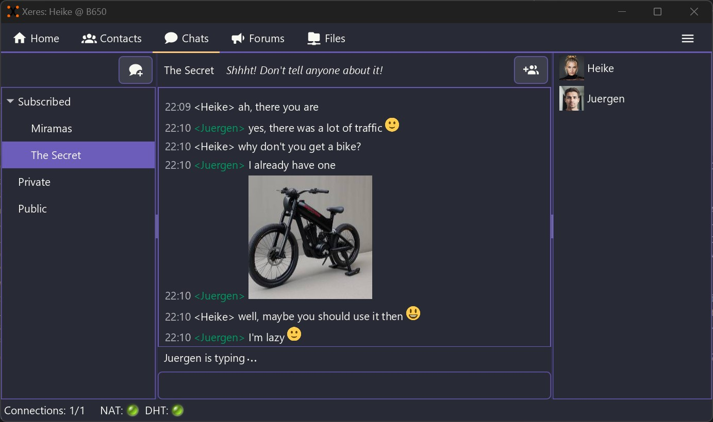

[Xeres](https://xeres.io) is a Friend-to-Friend, decentralized and secure application for communication and sharing.

[More screenshots](https://xeres.io/screenshots/)

---

## Features

- 🤝 Peer-to-Peer ([Friend-to-Friend](https://en.wikipedia.org/wiki/Friend-to-friend)), fully decentralized
- 🚫 No censorship. Cannot be censored
- 💬 Chat directly with your friends or in chat rooms
- 📢 Participate in forums and discuss any topic
- 📂 Share and search files anonymously
- 👋 Compatible with [Retroshare](https://retroshare.cc) 0.6.6 or higher
- 🛠️ Hardware accelerated encryption
- 🖥️ Modern looking desktop user interface with several themes including dark mode
- 📶 Remote access, access your instance on the go (Android mobile client available [here](https://github.com/zapek/Xeres-Android))
- 📖 Free software ([GPL](https://www.gnu.org/licenses/quick-guide-gplv3.html))
- 😃 Available for Windows and Linux

## Releases

Latest release [here](https://github.com/zapek/Xeres/releases/latest).

The mobile client for Android is [here](https://github.com/zapek/Xeres-Android/releases/latest).

The docker image for headless installations is [here](https://hub.docker.com/r/zapek/xeres)

## Quick try

Install Xeres then connect to a [ChatServer](https://retroshare.ch).

## Getting Help

- [User Documentation & FAQ](https://xeres.io/docs/)
- [Discussions & Forums](https://github.com/zapek/Xeres/discussions)
- [Issues Reporting](https://github.com/zapek/Xeres/issues)

## Documentation

- [Technical Documentation](https://github.com/zapek/Xeres/wiki)
- [Roadmap](https://github.com/users/zapek/projects/4)

## Development

- [Development Help](https://github.com/zapek/Xeres/wiki#development)
- [Contributing](docs/contributing.md)

